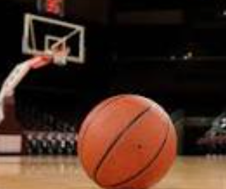
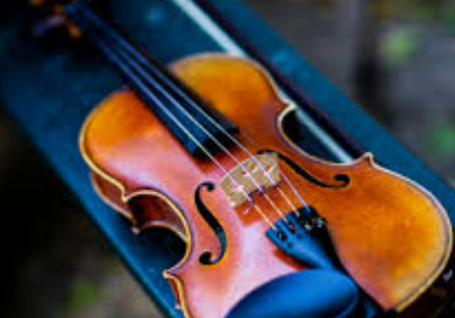
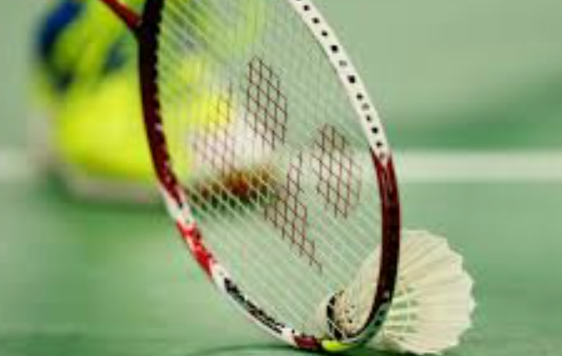

My name is Ishan Shrivastava, I am very intrigued by computer science and I have a lot of hobbies that I enjoy

My classes consist of :

1. Math 3A 
2. ENS 2
3. CompSci
4. Chem 1
5. HS English 2

I plan on pursueing Computer Science as a Major
I love to code for fun, and know Python Java, Bash, Javascript

* My extra Cirricular Activities consist of:

* CyberPatriot (Nation Champion, 1st place)

* USACO (USA Computing Olympiad) (Internationals Qulifier)

* ACSL (American Computer Science League) (Did Exception in Nationals)

* DECA

* Basketball

* Badminton

* Violin

* Watching Stephen Curry Hoop

